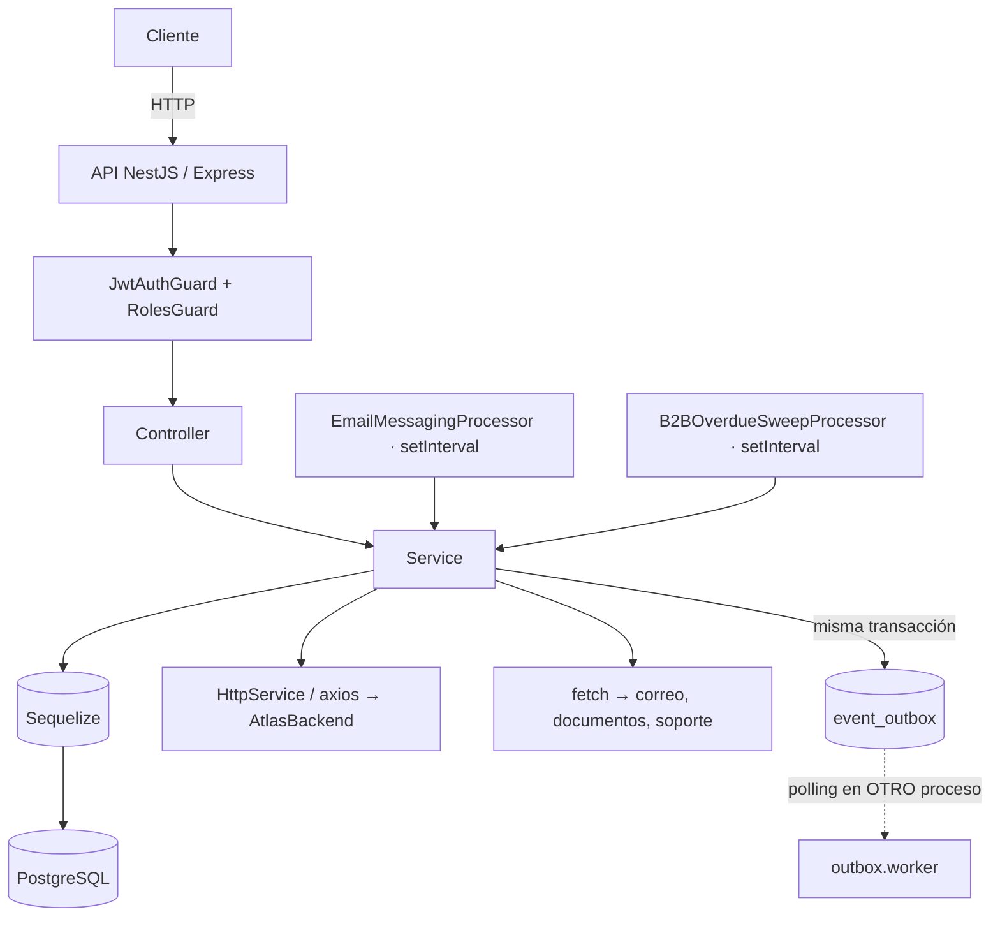

# Fase 0 — Auditoría del estado actual

Inspección del repositorio **antes** de tocar una línea de código.

## Conclusión en una frase

El ERP **no tiene trazas de ningún tipo**: ni SDK, ni dependencias, ni correlación. Lo que sí
tiene es un logger Pino bien montado y con redacción, un registro de accesos HTTP y dos
procesos que ya se separan correctamente. El trabajo es construir la capa entera, apoyándose en
lo que ya existe y sin duplicarlo.

## 1. Arquitectura detectada

| Elemento           | Valor real                                                                    | Fuente                                                           |
| ------------------ | ----------------------------------------------------------------------------- | ---------------------------------------------------------------- |
| Framework          | NestJS 11                                                                     | `package.json`                                                   |
| Módulos            | **CommonJS** (`"module": "commonjs"`) — imports sin extensión                 | `tsconfig.json`                                                  |
| Adaptador HTTP     | Express                                                                       | `main.ts`                                                        |
| ORM                | Sequelize 6 + `sequelize-typescript`                                          | `package.json`                                                   |
| Driver PostgreSQL  | `pg` 8; el worker usa un `Client` crudo                                       | `outbox.worker.ts`                                               |
| Redis              | **No se usa**                                                                 | —                                                                |
| HTTP saliente      | **Dos vías**: `@nestjs/axios` (`HttpService`) y `fetch` global en 3 servicios | `atlas-identity.client.ts`, `documents.service.ts`               |
| Logs               | **Pino 9 vía `nestjs-pino`**, con `redact` ya configurado                     | `app.module.ts`                                                  |
| Métricas           | No hay `prom-client`                                                          | —                                                                |
| Colas              | Outbox en PostgreSQL (`atlas_accounting.event_outbox`) + worker propio        | `outbox.worker.ts`                                               |
| Cron               | `setInterval` en dos procesadores dentro de la API                            | `email-messaging.processor.ts`, `b2b-overdue-sweep.processor.ts` |
| WebSockets         | No                                                                            | —                                                                |
| Configuración      | `env.ts` con zod                                                              | `src/config/env.ts`                                              |
| Gestor de paquetes | **Yarn** (`yarn.lock`) — hay además un `package-lock.json` desactualizado     | —                                                                |
| Prefijo global     | `api/v1`                                                                      | `env.API_GLOBAL_PREFIX`                                          |

### Procesos ejecutables

| Proceso          | Entrada                               | Qué es                                                                          |
| ---------------- | ------------------------------------- | ------------------------------------------------------------------------------- |
| API              | `src/main.ts`                         | `NestFactory.create`, controladores de negocio, sondas                          |
| Worker de outbox | `src/workers/outbox/outbox.worker.ts` | Proceso Node **suelto**: no usa Nest, abre su propio `pg.Client` y hace polling |

El worker es un `while` con `FOR UPDATE SKIP LOCKED` y un `publishEvent` que hoy **sólo registra
en el log**: marca la fila como publicada. Es el único salto asíncrono del backend.

### Flujo actual



El punteado es lo que hoy no se puede seguir.

## 2. Qué existe ya (y se conserva)

| Pieza                                                              | Archivo                 | Veredicto                                                       |
| ------------------------------------------------------------------ | ----------------------- | --------------------------------------------------------------- |
| Pino con `redact` de `authorization`, `cookie`, `password`, tokens | `app.module.ts`         | **Se conserva tal cual**; sólo se le añaden los campos de traza |
| `HttpAccessRegistryService`                                        | `common/observability/` | Intacto: es un inventario de rutas, no telemetría               |
| `RequestContextMiddleware`                                         | `common/middleware/`    | Intacto: correlación de negocio, complementaria                 |
| Separación API / worker                                            | dos entrypoints         | Ya correcta; cada uno recibirá su propio SDK y su nombre        |
| `HttpExceptionFilter`                                              | `common/filters/`       | Se le añade el marcado del span, nada más                       |

## 3. Huecos a cerrar

1. **Cero trazas.** No hay dependencias de OpenTelemetry. → Fases 2 y 3.
2. **Sin correlación log↔traza.** Pino no emite `trace_id`. → Fase 6.
3. **Sin `x-trace-id`** en la respuesta. → Fase 6.
4. **El worker de outbox no tiene forma de continuar la traza**: la tabla
   `event_outbox` **no tiene columna de metadatos**. → Fase 12, requiere migración.
5. **Los dos `setInterval` no abren traza**, así que su trabajo sería invisible. → Fase 13.
6. **Sin Jaeger local ni verificación.** → Fases 14 y 21.

## 4. Datos sensibles: dónde podrían filtrarse

El ERP trata datos de comercios, facturación, contabilidad y campañas con destinatarios.

| Vector                                  | Riesgo                                   | Mitigación prevista                                       |
| --------------------------------------- | ---------------------------------------- | --------------------------------------------------------- |
| Cabeceras                               | `authorization`, `cookie`                | No activar `headersToSpanAttributes`                      |
| Parámetros SQL                          | Razón social, NIT, importes              | `enhancedDatabaseReporting: false`                        |
| **Literales incrustados por Sequelize** | El mismo problema medido en AtlasBackend | Redacción del texto de la consulta                        |
| URLs salientes                          | Tokens en la cadena de consulta          | Saneado antes de exportar                                 |
| Payload del outbox                      | Documento contable completo              | El portador viaja en **columna aparte**, no en el payload |
| Campañas                                | Correos de destinatarios                 | Ningún atributo de destinatario                           |

## 5. Endpoints excluidos del trazado

```
/health   /ready   /healthz   /readiness   /liveness   /metrics   /favicon.ico
```

Con el prefijo global quedan en `/api/v1/health` y `/api/v1/ready`, así que la exclusión
compara **sufijo**, no igualdad.

## 6. Riesgos de compatibilidad

| Riesgo                                                 | Cómo se contiene                                                      |
| ------------------------------------------------------ | --------------------------------------------------------------------- |
| `max-lines` y `lint` sobre todo el repo                | Se comprueba tras cada fase                                           |
| Gate `check:migration-lists`                           | La migración nueva se declara en las **tres** listas                  |
| `package-lock.json` desactualizado junto a `yarn.lock` | Se usa **yarn**; npm reescribiría el `yarn.lock` (regla del monorepo) |
| Dos copias de `@opentelemetry/instrumentation`         | Se fija toda la línea en 0.222, verificado en instalación limpia      |
| `noUncheckedIndexedAccess: true`                       | El código nuevo lo respeta                                            |
| Otras sesiones en el mismo árbol                       | Commit con `-- <rutas>`                                               |

## 7. Archivos que se van a modificar

```
package.json / yarn.lock                       dependencias OTel
.env.example                                   variables nuevas
src/main.ts                                    arranque del SDK como atlas-erp-api
src/workers/outbox/outbox.worker.ts            arranque propio + span consumidor
src/app.module.ts                              mixin de Pino + interceptor de x-trace-id
src/common/filters/http-exception.filter.ts    marcado del span
src/database/models/event_outbox.model.ts      columna trace_context
src/database/startup-migrations.ts             lista de arranque
src/modules/accounting/documents/services/accounting-documents.service.ts   portador al publicar
src/modules/ads/services/email-messaging.processor.ts      traza raíz
src/modules/b2b-sales-crm/services/b2b-overdue-sweep.processor.ts   traza raíz
```

## 8. Archivos que NO se tocan

- `HttpAccessRegistryService` y `RequestContextMiddleware`: resuelven otra cosa.
- La configuración de `redact` de Pino: ya es correcta y se amplía sólo con campos de traza.
- Cualquier lógica de negocio. Los spans se añaden envolviendo, no reescribiendo.

## Criterio de aceptación

Se entiende cómo arrancan los dos procesos y qué tecnologías hay de verdad. **Cumplido.**
