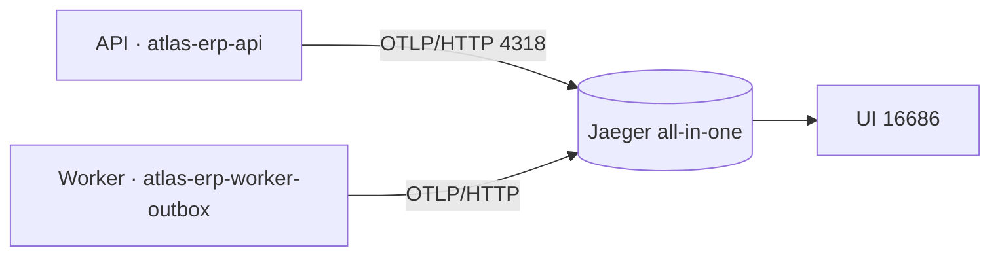
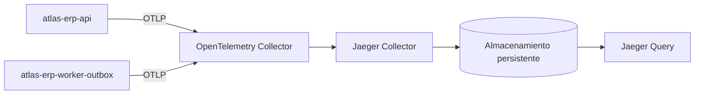

# Fase 1 — Diseño de la arquitectura de observabilidad

Cómo se integra OpenTelemetry en el ERP **sin que el dominio sepa que Jaeger existe**.

## Principio rector

```
Dominio → TracingService → @opentelemetry/api → NodeSDK → OTLP → Jaeger
          ^^^^^^^^^^^^^^
          única dependencia que ve un servicio de negocio
```

## Topologías

### Desarrollo



### Producción



## Decisiones

| Decisión                         | Elegido                                                   | Alternativa descartada              | Por qué                                                                                                                          |
| -------------------------------- | --------------------------------------------------------- | ----------------------------------- | -------------------------------------------------------------------------------------------------------------------------------- |
| Protocolo                        | **OTLP/HTTP**                                             | gRPC                                | Un puerto TCP normal y sin `@grpc/grpc-js` en la imagen                                                                          |
| Instrumentaciones                | **Cuatro, explícitas**: `http`, `express`, `pg`, `undici` | `auto-instrumentations-node`        | Cuarenta parches para usar cuatro. `fs` y `dns` entierran la operación de negocio                                                |
| **Sin `ioredis`**                | —                                                         | Instalarla igualmente               | **El ERP no usa Redis.** Instrumentar lo que no existe es peso muerto                                                            |
| **Sin instrumentación de axios** | `http` la cubre                                           | `instrumentation-axios` de terceros | Axios en Node emite por el módulo `http`, ya instrumentado. Añadirla duplicaría cada llamada                                     |
| Sequelize                        | **No se instrumenta**                                     | Paquete de terceros                 | El ORM emite por `pg`, ya instrumentado; duplicaría cada consulta                                                                |
| Muestreo                         | `ParentBasedSampler(TraceIdRatioBased)`                   | Siempre-sí                          | Si un servicio aguas arriba decidió muestrear, se respeta. **Importa aquí**: el ERP recibe llamadas de AtlasBackend y del portal |
| Propagadores                     | `tracecontext` + `baggage`                                | B3                                  | Sin consumidor heredado que lo exija                                                                                             |
| Logs                             | **`mixin` de Pino**                                       | Sustituir el logger                 | Pino ya está montado y con redacción; el mixin añade tres campos a CADA línea, no sólo a las de HTTP                             |
| Portador entre procesos          | **Columna nueva `trace_context jsonb`**                   | Clave reservada dentro de `payload` | Ver abajo                                                                                                                        |
| Activación                       | Opt-in (`OTEL_ENABLED=false`)                             | Siempre encendido                   | Quien no mira trazas no paga parcheo ni conexiones                                                                               |

### Por qué una columna y no una clave dentro del payload

`event_outbox.payload` es el **contrato de dominio** del evento: tiene un índice GIN encima y es
lo que saldrá hacia un broker el día que `publishEvent` deje de ser un registro en el log. Meter
ahí `_otel` significaría que el contexto de traza acabe publicado como si fuera parte del hecho
de negocio, y que cualquier consumidor externo tenga que aprender a ignorarlo.

La alternativa cuesta una migración —`ALTER TABLE … ADD COLUMN trace_context jsonb`, aditiva y
sin escribir un solo dato— y deja el transporte separado del contenido, que es la misma decisión
que ya toma AtlasBackend con su `metadata_json`.

El gate `check:migration-lists` obliga a declararla en las **tres** listas, así que no puede
quedarse a medias en un entorno.

## Identidad de los servicios

| Proceso                               | `service.name`            | Sobrescribible con  |
| ------------------------------------- | ------------------------- | ------------------- |
| `src/main.ts`                         | `atlas-erp-api`           | `OTEL_SERVICE_NAME` |
| `src/workers/outbox/outbox.worker.ts` | `atlas-erp-worker-outbox` | `OTEL_SERVICE_NAME` |

Recurso común: `service.namespace=atlas`, `service.version`, `deployment.environment.name`.

Compartir nombre entre los dos haría que el grafo de Jaeger mostrara un solo nodo hablando
consigo mismo.

## Convenciones

**Spans de negocio:** `<dominio>.<acción>`, estables y **sin identificadores**.

```
accounting.document.post    outbox.publish    outbox.dispatch    job.run
```

**Atributos propios**, namespace `app.*`:

```
app.module   app.operation   app.entity.type   app.entity.id
app.job.name app.job.outcome app.job.processed.count   app.event.type
```

## Atributos prohibidos

Contraseñas, tokens, cookies, `Authorization`, razón social, NIT, correos de destinatarios,
importes, cuerpos de petición o respuesta, valores de parámetros SQL, cadenas de consulta,
variables de entorno.

## Política de errores

La excepción se registra **una sola vez**, en el span donde nace; la descripción del estado es
un **código estable**, nunca el mensaje; el error se **relanza** intacto. Un 5xx marca el span;
un 4xx sólo deja su código, porque el llamante se equivocó y no el servicio.

## Estrategia de cierre

`SIGTERM`/`SIGINT` → `stopTracing()`. **Nunca lanza.** En el worker se encadena al apagado
controlado que ya existe, antes de cerrar el `pg.Client`.

## Estrategia para el trabajo asíncrono

```mermaid
sequenceDiagram
  participant API as atlas-erp-api
  participant DB as event_outbox
  participant W as atlas-erp-worker-outbox
  API->>API: span outbox.publish (PRODUCER)
  API->>DB: INSERT … trace_context = {traceparent}
  Note over DB: commit; el contexto en memoria muere aquí
  W->>DB: SELECT … FOR UPDATE SKIP LOCKED
  W->>W: propagation.extract(trace_context)
  W->>W: span outbox.dispatch (CONSUMER, padre = el productor)
```

Una fila anterior a esta columna trae `NULL` y el consumidor abre una traza raíz: **se procesa
igual**.

## Muestreo

| Entorno    | Ratio                                   |
| ---------- | --------------------------------------- |
| desarrollo | 1.0                                     |
| pruebas    | exportador en memoria                   |
| staging    | 0.25 – 1.0                              |
| producción | 0.05 – 0.20, **a ajustar con medición** |

## Estructura de archivos

```
src/observability/
├── telemetry.config.ts        lectura y acotado de process.env
├── telemetry.constants.ts     nombres de span, atributos, exclusiones
├── telemetry.types.ts         tipos de la capa
├── telemetry.instrumentations.ts  las cuatro instrumentaciones
├── sql-redaction.ts           borra literales incrustados por Sequelize
├── redacting-span-processor.ts    quita la query de las URLs antes de exportar
└── tracing.ts                 startTracing / stopTracing

src/common/observability/      (existente)
├── tracing.service.ts             fachada para el dominio
├── trace-context.service.ts       lectura de trace_id / span_id
├── trace-error.ts                 registro uniforme de excepciones
├── trace-response.interceptor.ts  cabecera x-trace-id
└── messaging-trace.service.ts     inyección / extracción entre procesos
```

El arranque vive fuera de `common/` porque es lo único que corre fuera del contenedor de Nest.

## Criterio de aceptación

Cada decisión tiene alternativa evaluada y motivo. **Cumplido.**
