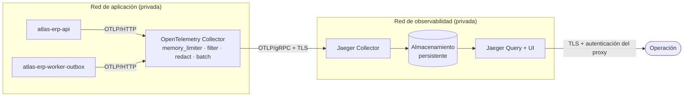

# Fase 16 — Topología de producción

El `all-in-one` con almacenamiento en memoria vale para desarrollo, demostraciones y pruebas
locales. **No vale para producción**, y el motivo no es de estilo: pierde todas las trazas en
cada reinicio y su memoria crece sin cota hasta que el demonio mata el contenedor — normalmente
a mitad de la sesión de depuración que motivó mirarlo.

## Topología

## Componentes y puertos

| Componente            | Puerto      | Expuesto a                     | Notas                            |
| --------------------- | ----------- | ------------------------------ | -------------------------------- |
| Collector — OTLP/HTTP | 4318        | Sólo la red de aplicación      | Lo que usan los dos procesos     |
| Collector — OTLP/gRPC | 4317        | Sólo la red de aplicación      | Disponible, hoy sin uso          |
| Collector — health    | 13133       | Sólo el orquestador            | `health_check`                   |
| Jaeger Collector      | 4317        | Sólo el Collector              | TLS, `insecure: false`           |
| Jaeger Query / UI     | 16686       | Sólo tras el proxy autenticado | **Nunca** publicado directamente |
| Almacenamiento        | según motor | Sólo Jaeger                    | Nunca desde la red de aplicación |

Ninguna de estas escuchas se liga a `0.0.0.0`: el despliegue inyecta
`OTEL_COLLECTOR_BIND_HOST` con la interfaz interna.

## Por qué hay un Collector y no exportación directa

|                          | Directo a Jaeger                          | Con Collector                                      |
| ------------------------ | ----------------------------------------- | -------------------------------------------------- |
| Cambiar Jaeger de sitio  | Variable en tres despliegues              | Ninguna en la aplicación                           |
| Jaeger cae               | El exportador reintenta **en el proceso** | La cola espera **fuera** del camino de la petición |
| Atributo sensible nuevo  | Ya está almacenado                        | Se borra antes de persistir                        |
| Muestreo por cola (tail) | Imposible                                 | Posible sin tocar el código                        |

La tercera fila es la que decide en este backend: trata datos de comercios, facturación y contabilidad, y la
redacción en el Collector es la última red antes de que un dato personal quede escrito en un
almacén que se consulta sin las restricciones de la base de datos.

## Almacenamiento

**No se despliega un motor de almacenamiento nuevo sin justificarlo.** Opciones soportadas
oficialmente por Jaeger, evaluadas contra la infraestructura que Atlas ya opera:

| Motor                          | A favor                                              | En contra                                       | Veredicto                      |
| ------------------------------ | ---------------------------------------------------- | ----------------------------------------------- | ------------------------------ |
| **Memoria**                    | Cero operación                                       | Se pierde todo al reiniciar; sin cota real      | Sólo desarrollo                |
| **Badger** (disco local)       | Un contenedor, un volumen; cero servicios nuevos     | Un solo nodo, sin alta disponibilidad           | **Recomendado para empezar**   |
| **OpenSearch / Elasticsearch** | Retención larga, búsqueda potente, escala horizontal | Un clúster más que operar, respaldar y parchear | Cuando el volumen lo exija     |
| **Cassandra**                  | Escritura masiva sostenida                           | La operación más cara de las tres               | No, sin un volumen que lo pida |

**Decisión: empezar con Badger.** El volumen previsto de Atlas —un backend de gestión con tráfico
interno de decenas de peticiones por minuto, muestreo del 5–20 %— cabe de sobra en un volumen de disco,
y añadir un clúster de búsqueda para eso sería infraestructura que hay que mantener sin que
nadie la haya pedido. La migración a OpenSearch es un cambio de configuración de Jaeger, no un
cambio de arquitectura: se hace el día que la retención o la búsqueda dejen de alcanzar.

El disparador explícito para reconsiderarlo: **la retención efectiva baja de 7 días** o **una
búsqueda por servicio tarda más de 5 s**.

## Retención

| Entorno    | Retención                           | Motivo                                                                                                                       |
| ---------- | ----------------------------------- | ---------------------------------------------------------------------------------------------------------------------------- |
| desarrollo | Lo que quepa en `MEMORY_MAX_TRACES` | Se depura lo de hace un minuto                                                                                               |
| staging    | 3 días                              | Cubre un fin de semana                                                                                                       |
| producción | **7 días**                          | Un incidente se investiga en la semana; más allá, la evidencia que importa está en la auditoría de la base, no en las trazas |

La retención es también un **control de privacidad**: cuanto menos tiempo vivan las trazas,
menor es la superficie de cualquier fuga. Ver `04-data-privacy-policy.md`.

## Seguridad

- **La UI de Jaeger no se publica.** Va detrás del mismo proxy autenticado que el resto de
  consolas internas. Una UI de trazas sin autenticación es un buscador de la actividad de los
  clientes.
- **TLS entre Collector y Jaeger** (`insecure: false`).
- **OTLP nunca sale a Internet.** El Collector escucha sólo en la red de aplicación.
- **Red de observabilidad separada** de la de datos: Jaeger no alcanza a PostgreSQL,
  que es justo el punto de segmentar.

## Escalabilidad

| Señal                                                           | Qué se hace                                                               |
| --------------------------------------------------------------- | ------------------------------------------------------------------------- |
| El Collector descarta spans (`otelcol_processor_dropped_spans`) | Subir `queue_size`, luego replicar el Collector                           |
| La cola no drena                                                | Jaeger o el almacenamiento están al límite: mirar ahí, no en el Collector |
| Latencia de exportación creciente                               | Bajar el ratio de muestreo antes que ampliar la infraestructura           |
| Alta disponibilidad de la UI                                    | Dos réplicas de Jaeger Query contra el mismo almacenamiento               |

## Recuperación

| Fallo                  | Consecuencia para el negocio                                                     | Acción                                                                                                                                   |
| ---------------------- | -------------------------------------------------------------------------------- | ---------------------------------------------------------------------------------------------------------------------------------------- |
| Collector caído        | **Ninguna.** El exportador del proceso falla en segundo plano y se pierden spans | Reiniciarlo; la aplicación no se toca                                                                                                    |
| Jaeger caído           | **Ninguna.** La cola del Collector retiene hasta 5 min                           | Reiniciarlo antes de que `max_elapsed_time` venza                                                                                        |
| Almacenamiento perdido | Se pierde el histórico de trazas                                                 | No se restaura: las trazas son evidencia **efímera** por diseño. La evidencia duradera son la auditoría y el outbox, que sí se respaldan |

La invariante que ninguna de estas filas rompe: **la aplicación nunca depende de que el destino
de trazas esté disponible para atender una petición de negocio.**

## Coste operativo, cualitativamente

- **Collector:** un contenedor por despliegue, sin estado, sin respaldo. Coste bajo.
- **Jaeger + Badger:** un contenedor y un volumen. Coste bajo; el volumen se dimensiona por
  retención × volumen muestreado.
- **Si se pasa a OpenSearch:** deja de ser bajo. Un clúster de búsqueda es el componente más
  caro de operar de esta lista, y ése es el argumento para no empezar por él.
