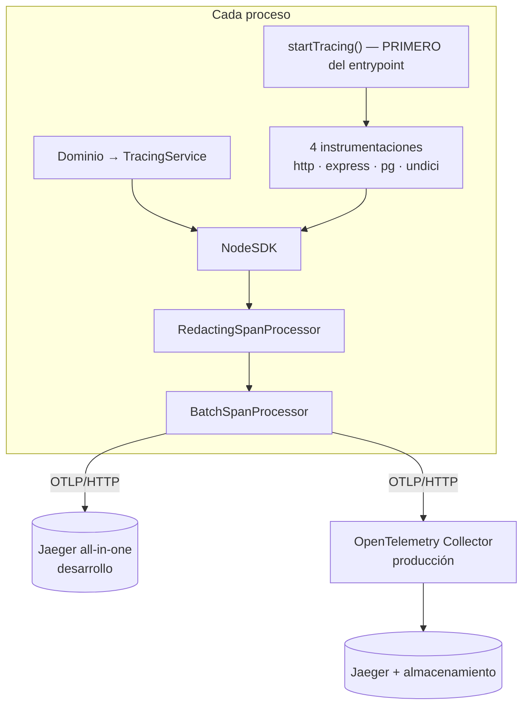

# Informe de implementación — trazabilidad distribuida en el ERP

Fecha: 2026-09-18. Estado final al pie.

## 1. Resumen ejecutivo

El ERP **no tenía trazas de ningún tipo**: ni SDK, ni dependencias, ni correlación entre un log
y la petición que lo produjo. Tenía un Pino bien montado y con redacción, y dos procesos ya
separados; sobre eso se ha construido la capa entera.

Ahora una petición produce una traza legible que atraviesa HTTP, controlador y PostgreSQL; el
`trace_id` viaja en la respuesta —también cuando el rechazo lo emite un guard— y en cada línea
de log; el trabajo que salta al worker de outbox **conserva la misma traza**; los dos
procesadores periódicos abren su propia traza raíz; y tres barreras impiden que un dato de
negocio llegue al almacén.

## 2. Arquitectura final



Dos procesos, dos nombres: `atlas-erp-api` y `atlas-erp-worker-outbox`.

## 3. Archivos creados

| Archivo | Responsabilidad |
| --- | --- |
| `src/observability/telemetry.{types,constants,config}.ts` | Contratos, nombres y lectura del entorno |
| `src/observability/telemetry.instrumentations.ts` | Las cuatro instrumentaciones y sus exclusiones |
| `src/observability/sql-redaction.ts` | Borra los literales que Sequelize incrusta |
| `src/observability/redacting-span-processor.ts` | Quita la query de las URLs antes de exportar |
| `src/observability/tracing.ts` | Arranque y cierre del SDK |
| `src/common/observability/tracing.service.ts` | Fachada para el dominio |
| `src/common/observability/trace-context.service.ts` | Lee `trace_id` / `span_id` activos |
| `src/common/observability/trace-error.ts` | Registro uniforme de excepciones |
| `src/common/observability/trace-id-header.ts` | Cabecera `x-trace-id`, compartida por interceptor y filtro |
| `src/common/observability/trace-response.interceptor.ts` | Camino feliz de esa cabecera |
| `src/common/observability/trace-log-fields.ts` | Campos de traza para el `mixin` de Pino |
| `src/common/observability/messaging-trace.service.ts` | Inyección y extracción entre procesos |
| `src/common/observability/messaging-attributes.ts` | Atributos de mensajería, definidos una vez |
| `src/database/migrations/20260918230000-outbox-trace-context.sql` | Columna `trace_context jsonb` |
| `docker-compose.jaeger.yml` | Jaeger local, capa sobre el compose principal |
| `infra/otel-collector/otel-collector.config.yml` | Collector de producción |
| `scripts/verify-jaeger.sh` + `scripts/emit-verification-span.ts` | Comprobación de punta a punta |
| `docs/observability/*.md` | Ocho documentos |
| 12 ficheros de prueba | 122 unitarias + 4 de integración |

## 4. Archivos modificados

| Archivo | Cambio |
| --- | --- |
| `src/main.ts` | `startTracing('atlas-erp-api')` como primera sentencia; cierre en SIGTERM/SIGINT; interceptor de traza el más externo |
| `src/workers/outbox/outbox.worker.ts` | SDK propio, span CONSUMER enlazado, lectura de `trace_context`, cierre antes de soltar la conexión |
| `src/app.module.ts` | `mixin` de Pino con los campos de traza; proveedor del interceptor |
| `src/common/observability/observability.module.ts` | Registra y exporta la capa de trazado |
| `src/common/filters/http-exception.filter.ts` | Marca el span y **emite `x-trace-id`** también aquí |
| `src/database/models/event_outbox.model.ts` | Columna `traceContext` |
| `src/database/startup-migrations.ts`, `package.json` | La migración nueva en las **tres** listas |
| `accounting-documents.service.ts` | Dos spans de negocio; las tres publicaciones al outbox unificadas con span PRODUCER y portador |
| `email-messaging.processor.ts`, `b2b-overdue-sweep.processor.ts` | Traza raíz por tanda |
| `.env.example` | 13 variables documentadas |

## 5. Instrumentaciones activas

| Tecnología | Paquete | Qué cubre |
| --- | --- | --- |
| HTTP | `instrumentation-http@0.222` | Entrante y saliente — **incluido axios**, que emite por `http` |
| Express | `instrumentation-express@0.70` | Enrutado (**sin** capas de middleware) |
| PostgreSQL | `instrumentation-pg@0.74` | Sequelize y el `Client` crudo del worker, con el SQL redactado |
| `fetch` | `instrumentation-undici@0.32` | Correo, documentos y la pasarela de soporte |

**No se instrumenta Redis** (el ERP no lo usa), **ni axios**, **ni Sequelize**: los dos últimos
emiten por `http` y `pg`, que ya están instrumentados, y añadirlos duplicaría cada llamada.

## 6. Spans de negocio

`accounting.document.draft`, `accounting.document.post`, `outbox.publish` (PRODUCER),
`outbox.dispatch` (CONSUMER) y `job.run` (raíz, en los dos procesadores). Catálogo y criterio de
admisión en `02-business-spans-catalog.md`.

## 7. Correlación de logs

Un `mixin` de Pino añade `trace_id`, `span_id` y `trace_flags` a **cada** línea, no sólo a la
que emite `pino-http`. Verificado: el `x-trace-id` de la respuesta y el `trace_id` de la línea
de log de esa petición son el mismo valor.

## 8. Workers y propagación

La API escribe el portador W3C en `event_outbox.trace_context` **dentro** del span productor;
el worker lo extrae al reclamar y abre un span consumidor con ese padre. Verificado contra
PostgreSQL real: mismo `trace_id`, `span_id` distintos, relación padre-hijo correcta. Una fila
con `NULL`, con portador manipulado o anterior a la migración **se procesa igual**.

La migración es aditiva, no escribe un solo dato y se comprobó **idempotente** aplicándola tres
veces contra PostgreSQL 16.

## 9. Seguridad

1. **La instrumentación no lo captura**: sin cabeceras, sin parámetros ligados, sin cuerpos.
2. **En proceso**: `redactSqlLiterals` y `RedactingSpanProcessor`.
3. **En el Collector**: `attributes/redact`, para lo que empiece a emitirse tras una subida de
   versión sin que nadie lo note.

Verificado sobre una traza real de una búsqueda: el término buscado —un correo— **no aparece en
ninguna parte**, pese a que Sequelize lo incrusta en el `ILIKE`.

## 10. Pruebas realizadas

| Comando | Resultado |
| --- | --- |
| `yarn type-check` | ✅ |
| `yarn lint` | ✅ sin avisos |
| `yarn check:migration-lists` | ✅ 28 archivos, mismo orden en las tres listas |
| `yarn test` | ✅ **1133 pruebas, 60 suites** (eran 1011) |
| Integración del outbox contra PostgreSQL real | ✅ 4 pruebas; **se SALTAN** sin base, no fingen pasar |
| Migración contra PostgreSQL 16 | ✅ aplicada + idempotente en tres pasadas |
| `yarn jaeger:verify` | ✅ cadena completa |
| E2E manual contra Jaeger real | ✅ jerarquía correcta, sondas excluidas, sin fugas, log correlacionado |

La configuración del Collector se validó con el binario real
(`otel/opentelemetry-collector-contrib:0.138.0 validate`).

## 11. Rendimiento

**No medido bajo carga.** Lo medido y el método para lo que falta, en `05-performance-results.md`.

## 12. Uso local

```bash
yarn jaeger:up
# en .env:  OTEL_ENABLED=true
#           OTEL_EXPORTER_OTLP_TRACES_ENDPOINT=http://localhost:4328/v1/traces
yarn start:dev
yarn jaeger:verify     # UI: http://localhost:16687
```

## 13. Producción

Collector como sidecar → Jaeger Collector/Query → almacenamiento persistente (Badger para
empezar). Retención de 7 días. UI nunca publicada. Ver `03-production-topology.md`.

## 14. Riesgos restantes

| Riesgo | Estado |
| --- | --- |
| **Sobrecarga sin medir bajo carga** | Abierto: el repositorio no tiene arnés de carga |
| Subir `pg`, `express` o `undici` puede dejar su instrumentación muda sin un solo error | Mitigado con procedimiento en el runbook §1; **no hay gate automático** |
| `publishEvent` del worker sigue siendo un stub que sólo registra en el log | Preexistente. Cuando se conecte un broker real, el `traceparent` debe pasar a las CABECERAS del mensaje: la columna es el transporte correcto mientras el transporte sea la propia tabla |
| `package-lock.json` desactualizado junto a `yarn.lock` | Preexistente; se ha usado **yarn**, que es lo que el monorepo exige |
| La instrumentación de HTTP saliente no se ejercitó contra un proveedor real | Abierto |

## 15. Matriz de cumplimiento

| Requisito | Estado | Evidencia |
| --- | ---: | --- |
| Jaeger se levanta localmente | Cumplido | `docker-compose.jaeger.yml`, `yarn jaeger:up` |
| Arranca con observabilidad encendida / apagada | Cumplido | E2E en `:3098` y `telemetry.config.spec.ts` |
| Funciona con Jaeger caído | Cumplido | Exportación asíncrona; el proceso no cae |
| Trazas HTTP | Cumplido | Traza real |
| Controllers en el flujo | Cumplido | `request handler - …` |
| Spans de negocio | Cumplido | `02-business-spans-catalog.md` |
| PostgreSQL | Cumplido | `pg.query` con SQL redactado |
| Sequelize instrumentado | Cumplido **por `pg`** | Decisión justificada en `01` |
| Redis | **No aplica** | El ERP no usa Redis; se documenta en vez de instalar el paquete |
| HTTP externo | Parcial | `http` y `undici` activos; **no ejercitado** con un proveedor real |
| Errores marcados | Cumplido | 5xx marca el span; 4xx sólo deja su código |
| Logs con `trace_id` | Cumplido | Verificado contra la cabecera de la misma petición |
| `x-trace-id` en la respuesta | Cumplido **incluido el 401 de un guard** | Ver §16 |
| API y worker en la misma traza | Cumplido | 4 pruebas contra PostgreSQL real |
| Cron con traza raíz | Cumplido | Los dos procesadores |
| Health checks excluidos | Cumplido | Verificado |
| Sin tokens, contraseñas ni datos de negocio | Cumplido | Búsqueda directa sobre la traza real |
| Pruebas unitarias / integración / E2E | Cumplido | 1133 / 4 / `jaeger:verify` |
| Lint y build | Cumplido | Sin avisos |
| Documentación, runbook y diseño de producción | Cumplido | Ocho documentos |
| **Rendimiento medido** | **NO cumplido** | Declarado abierto |

## 16. Un hallazgo que sólo apareció ejecutándolo

`x-trace-id` **no salía en los 401**. En NestJS los guards corren **antes** que los
interceptores, así que un rechazo de autorización salta directo al filtro de excepciones y el
interceptor no llega a ejecutarse. La cabecera faltaba justo en el caso en que más se pide
—«no me deja entrar»— y eso no se ve compilando ni en una prueba del interceptor: se vio
pidiendo la cabecera a un endpoint protegido y encontrándola vacía.

Arreglado emitiéndola también desde el filtro, con un ayudante idempotente compartido por los
dos caminos. **El mismo arreglo se aplicó a AtlasBackend**, que tenía el mismo hueco.

## 17. Estado final

```
COMPLETO CON OBSERVACIONES
```

Todo lo instrumentado está verificado ejecutándolo. Las observaciones que impiden declararlo
`COMPLETO` son explícitas: **la sobrecarga no se ha medido bajo carga** y **la instrumentación
de HTTP saliente no se ha ejercitado contra un proveedor real**.
