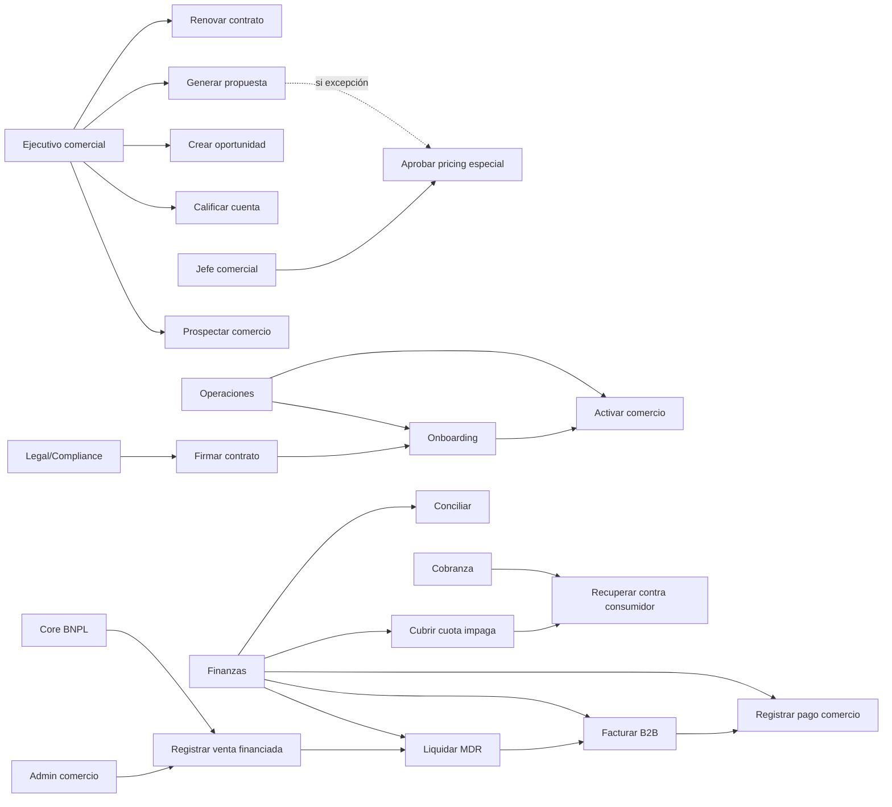
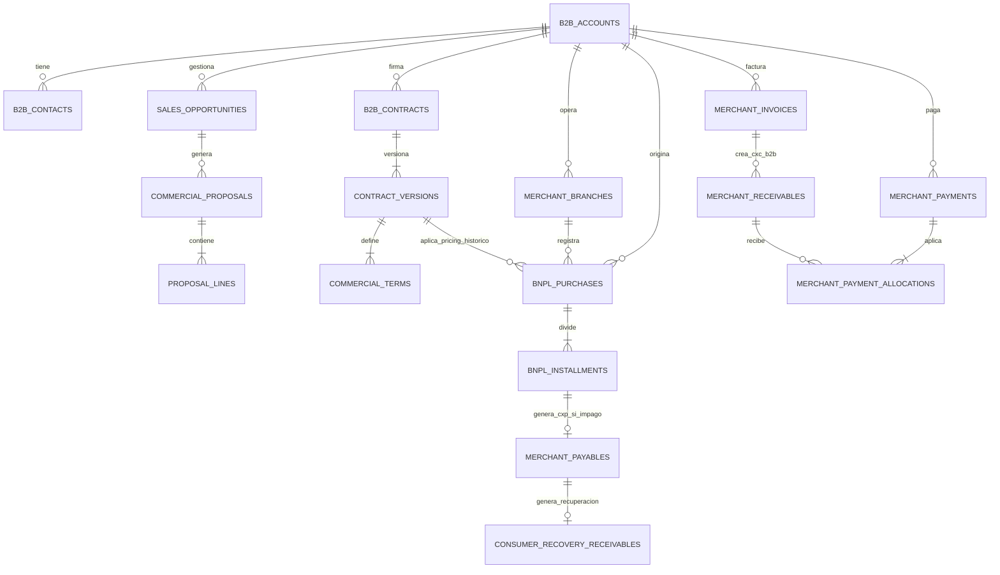
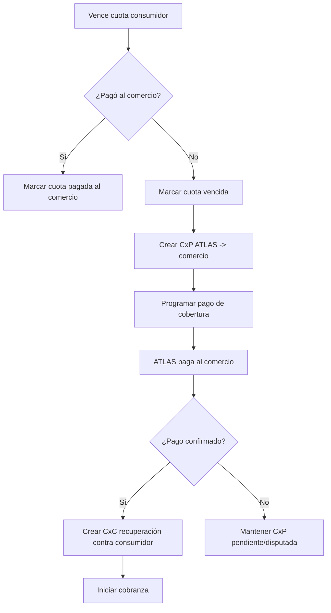

# Diagramas Mermaid — ATLAS CRM/Ventas B2B

## Casos de uso resumidos

```mermaid
flowchart LR
  Sales[Ejecutivo comercial] --> UC01[Prospectar comercio]
  Sales --> UC02[Calificar cuenta]
  Sales --> UC03[Crear oportunidad]
  Sales --> UC04[Generar propuesta]
  Manager[Jefe comercial] --> UC05[Aprobar pricing especial]
  Legal[Legal/Compliance] --> UC06[Firmar contrato]
  Ops[Operaciones] --> UC07[Onboarding]
  Ops --> UC08[Activar comercio]
  Merchant[Admin comercio] --> UC09[Registrar venta financiada]
  Core[Core BNPL] --> UC09
  Finance[Finanzas] --> UC10[Liquidar MDR]
  Finance --> UC11[Facturar B2B]
  Finance --> UC12[Registrar pago comercio]
  Finance --> UC13[Cubrir cuota impaga]
  Collections[Cobranza] --> UC14[Recuperar contra consumidor]
  Finance --> UC15[Conciliar]
  Sales --> UC16[Renovar contrato]

  UC04 -.si excepción.-> UC05
  UC06 --> UC07 --> UC08
  UC09 --> UC10 --> UC11 --> UC12
  UC13 --> UC14
```

## Modelo relacional resumido

```mermaid
erDiagram
  B2B_ACCOUNTS ||--o{ B2B_CONTACTS : tiene
  B2B_ACCOUNTS ||--o{ SALES_OPPORTUNITIES : gestiona
  SALES_OPPORTUNITIES ||--o{ COMMERCIAL_PROPOSALS : genera
  COMMERCIAL_PROPOSALS ||--|{ PROPOSAL_LINES : contiene
  B2B_ACCOUNTS ||--o{ B2B_CONTRACTS : firma
  B2B_CONTRACTS ||--|{ CONTRACT_VERSIONS : versiona
  CONTRACT_VERSIONS ||--|{ COMMERCIAL_TERMS : define
  B2B_ACCOUNTS ||--o{ MERCHANT_BRANCHES : opera
  B2B_ACCOUNTS ||--o{ BNPL_PURCHASES : origina
  MERCHANT_BRANCHES ||--o{ BNPL_PURCHASES : registra
  CONTRACT_VERSIONS ||--o{ BNPL_PURCHASES : aplica_pricing_historico
  BNPL_PURCHASES ||--|{ BNPL_INSTALLMENTS : divide
  B2B_ACCOUNTS ||--o{ MERCHANT_INVOICES : factura
  MERCHANT_INVOICES ||--o{ MERCHANT_RECEIVABLES : crea_cxc_b2b
  B2B_ACCOUNTS ||--o{ MERCHANT_PAYMENTS : paga
  MERCHANT_PAYMENTS ||--|{ MERCHANT_PAYMENT_ALLOCATIONS : aplica
  MERCHANT_RECEIVABLES ||--o{ MERCHANT_PAYMENT_ALLOCATIONS : recibe
  BNPL_INSTALLMENTS ||--o| MERCHANT_PAYABLES : genera_cxp_si_impago
  MERCHANT_PAYABLES ||--o| CONSUMER_RECOVERY_RECEIVABLES : genera_recuperacion
```

## Actividad: cuota impaga, cobertura y recuperación

```mermaid
flowchart TD
  A[Vence cuota consumidor] --> B{¿Pagó al comercio?}
  B -- Sí --> C[Marcar cuota pagada al comercio]
  B -- No --> D[Marcar cuota vencida]
  D --> E[Crear CxP ATLAS -> comercio]
  E --> F[Programar pago de cobertura]
  F --> G[ATLAS paga al comercio]
  G --> H{¿Pago confirmado?}
  H -- Sí --> I[Crear CxC recuperación contra consumidor]
  H -- No --> J[Mantener CxP pendiente/disputada]
  I --> K[Iniciar cobranza]
```
